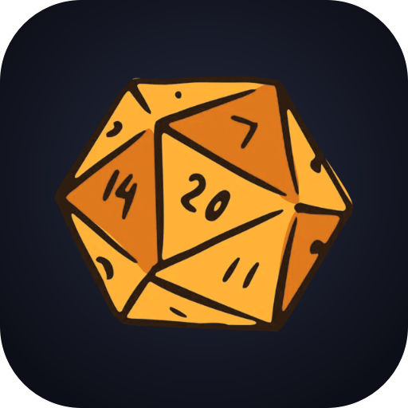
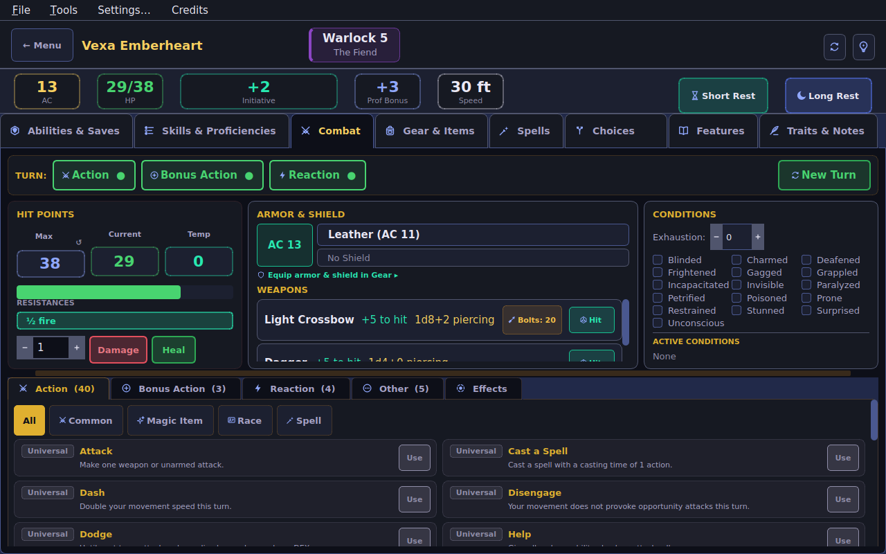
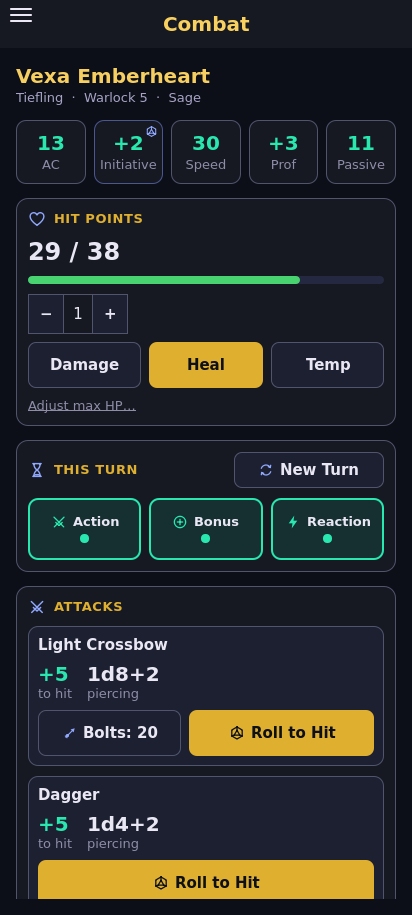
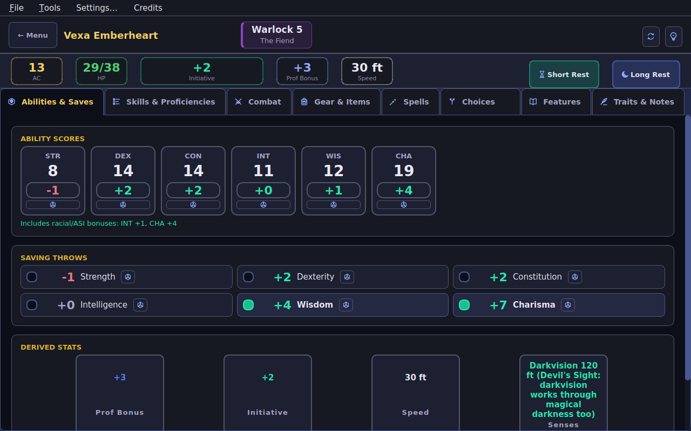
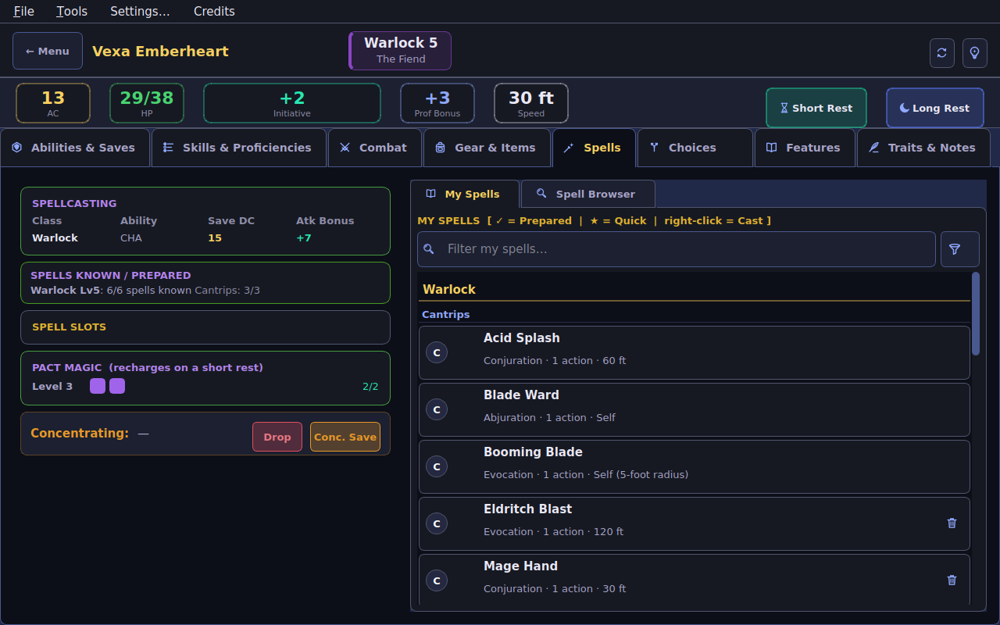
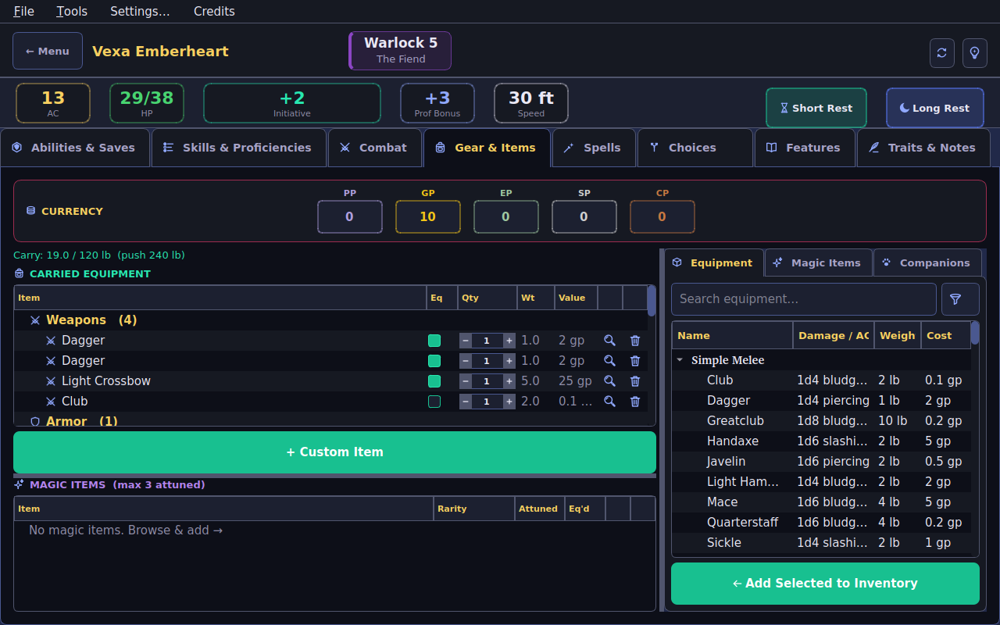
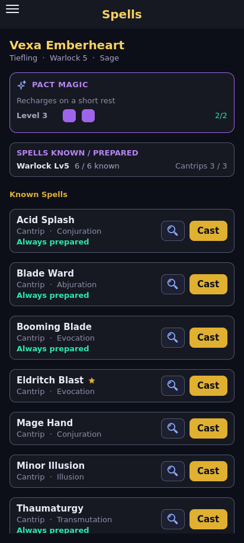
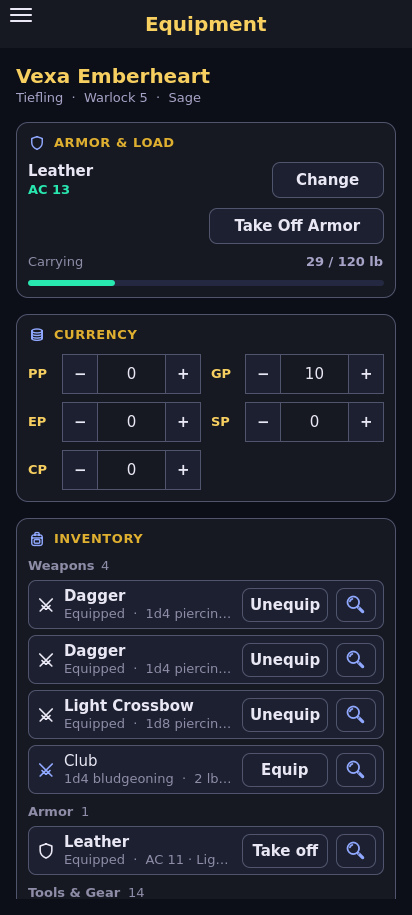

<!-- github-only -->
<p align="center">
  
</p>
<!-- /github-only -->

<h1 align="center">MIMIC</h1>

<p align="center">
  <b>A complete D&D 5e character creator and character sheet</b><br>
  for Windows, macOS, Linux and Android — offline, and free
</p>

<!-- github-only -->
<p align="center">
  
  
  
  
  
</p>

<p align="center">
  
  
</p>

<p align="center">
  <a href="#features">Features</a> ·
  <a href="#screenshots">Screenshots</a> ·
  <a href="#get-started">Get started</a> ·
  <a href="#build-it-yourself">Build it yourself</a> ·
  <a href="#project-layout">Project layout</a> ·
  <a href="#roadmap">Roadmap</a>
</p>
<!-- /github-only -->

MIMIC brings everything a player needs into one place: races, classes,
subclasses, spells, feats, backgrounds, magic items, companions, Wild Shape
and combat. Build a character, level it up, and play it at the table — on
your computer, or on your phone with the same character file.

<!-- github-only -->

| 85 | 14 | 127 | 511 | 138 | 99 | 1,283 |
|:---:|:---:|:---:|:---:|:---:|:---:|:---:|
| races | classes | subclasses | spells | feats | backgrounds | magic items |

<!-- /github-only -->

- **Rules that actually run** — magic items, invocations, maneuvers, infusions, conditions and rage carry their real mechanics, not just their text
- **One character, both apps** — the desktop and Android apps share one rules engine and one file format
- **Changes clean up after themselves** — level down, swap race or drop a feat, and everything that came with it goes too
- **Dying, resting and casting by the book** — massive damage, death saves, stabilising, rests, spell slots, concentration
- **Bring your old sheets** — a filled-in official 5e PDF character sheet becomes a full character
- **Yours, offline** — no account, no internet needed, free

---

## Features

<details open>
<summary><b>Game content</b> — races, classes, spells, items and more</summary>

- **85 races** with subraces from every official sourcebook, including modern (MPMM) revisions kept alongside their original printings where the two differ mechanically
- **14 classes**, Blood Hunter included, with **127 subclasses** (2014 rules) — audited line by line against the source text, not filled in from memory
- **511 spells** across all 9 levels, with per-class spell lists
- **138 feats** from PHB (2014 & 2024), XGE, TCE, FTD and more
- **99 backgrounds** from PHB (2014), plus adventure-specific backgrounds — 2024 Origin Feat backgrounds are left out, since the app follows the 2014 rules
- **1,283 magic items**, with real mechanical effects (ability score overrides, resistances, weapon bonuses, resource pools and more) wired for over 99% of the catalog
- **All standard weapons and armor** with computed attack bonuses and damage, plus browsable Silvered and Adamantine variants of every weapon (Adamantine for melee weapons only, per the real rule) with the right cost and rules text
- **A 28-beast Wild Shape catalog**, CR 1/4 to CR 6, filtered by your druid level and any race or beast restrictions
- **Full companion stat blocks** for the Steel Defender, Wildfire Spirit, Drake Companion, Dancing Item, Primal Companions (Beast of the Land/Sea/Sky) and Eldritch Cannon
- **11 races with real natural weapons** (Aarakocra Talons, Tabaxi Claws, Lizardfolk Bite, Minotaur Horns, Satyr Ram, Longtooth Shifter's Fangs and more) as weapon rows with computed attack and damage, in both original and MPMM printings

</details>

<details>
<summary><b>Character builder</b> — creation wizard, level-ups, multiclassing</summary>

- **A full creation wizard** — race, ability scores, background and class, spells, equipment
- **Point Buy, Standard Array or Manual Entry** for ability scores
- **Live race details** — picking a subrace updates the shown ASI and traits straight away
- **Full background details** — feature descriptions, bonus languages and starting equipment, shown in full
- **A starting equipment picker** with class-appropriate options — every chosen item lands in your inventory, alongside your background's own equipment and starting gold
- **A level-up wizard** that walks through each level's choices, nested sub-choices included
- **Multiclassing** with the full rules for combining classes
- **Level changes stay consistent** — Level Up stops at 20; a class that drops below its subclass level sets the subclass aside, and it comes back when the class gets there again; Level Up, Level Down and Remove Class grey out (saying why) when they can't apply
- **Skills follow your character** — expertise and skill picks from a level you no longer have (or a removed class) go with it, while your own edits on the Skills tab stay until you reset them
- **Changes leave nothing behind** — level down, remove a class, or change race, subrace, background or a feat, and what came with it goes too: invocations, maneuvers, infusions, fighting styles, Magical Secrets, a race's cantrip, and any pick those opened up (Pact of the Tome's cantrips). Level back up and you're asked again
- **Checks add what they should** — a plain ability check gets Jack of All Trades, and a Fey Wanderer's Otherworldly Glamour gives a skill of your choice plus its Wisdom bonus on every Charisma check

</details>

<details>
<summary><b>Spells</b> — known and prepared, slots, concentration, scrolls</summary>

- **Prepared and known spells**, with **spell slots by level** calculated and tracked
- **Your limits, per class** — each casting class shows spells known or prepared against its cap, plus cantrips (e.g. "Cleric Lv5: 3 / 8 prepared (WIS+lvl) · Cantrips 3 / 4"); multiclass casters are counted per class, never pooled
- **Concentration tracking**, with save prompts when you take damage
- **Only ready spells cast** — an unprepared spell can't be cast until you prepare it, and rituals follow each class's own rule (a Wizard's from the spellbook, a Cleric's or Druid's only once prepared)
- **Granted spells stay put** — domain, oath, patron, racial and feat spells are always prepared and can't be removed
- **Auto-prepared spells** for domains, oaths, circles, patrons and sorcerer origins (Aberrant Mind, Clockwork Soul, Lunar Sorcery), each from a verified spell list
- **Spells follow your classes** — removing a class takes the spells only it could cast; spells on a class list you still have, and anything from your race, a feat or a subclass, stay. A Cleric, Druid, Paladin or Artificer that levels down loses the list spells beyond its new level (they return on level up); spells you picked yourself are never touched
- **Free daily casts** — spells from your race or a feat (a Tiefling's Hellish Rebuke and Darkness, Fey Touched's Misty Step, Firbolg Magic, Telepathic's Detect Thoughts...) each get a once-per-rest counter, and Cast uses it before a spell slot — so a Fighter can still throw their Hellish Rebuke
- **Spell scrolls carry their spell** — **Use** casts it with no slot and no material components, at the scroll's own save DC and attack bonus. Following the DMG, a spell not on your class list can't be read, and one above the level you can cast needs a spellcasting check (DC 10 + its level) or the scroll is lost
- **A searchable spell browser** — the search box gets the whole row; class and level filters sit behind a funnel button
- **Ritual and quick-cast markers**, and spell descriptions on hover

</details>

<details>
<summary><b>Combat</b> — HP, turns, actions, dying, conditions, ammunition</summary>

- **Full HP tracking** — max, current and temporary HP, with one-click damage and healing
- **A turn tracker** — Action, Bonus Action and Reaction, with a one-click New Turn
- **Every real action you have**, filterable by category and spell level, each using the right part of your turn — and the "one leveled spell per turn" rule enforced, with Haste's extra action recognised
- **Casting a buff applies it** — a spell that matches an existing buff or condition switches it on
- **Class resources** — Rage, Ki, Sorcery Points, Superiority Dice, Channel Divinity and every other one, reset by short and long rests
- **Dying by the book** — temp HP soak damage first; massive damage (enough left over after hitting 0 HP to equal your maximum) kills outright; at 0 HP you're unconscious and a hit is a failed death save; three successes leave you stable, still out cold at 0 HP until healed (or 1 HP after 1d4 hours); the dead can't be healed until revived, and the death screen says what killed you
- **Conditions and exhaustion with real effects** on saves, attacks, ability checks and movement — Surprised included (no moving, acting or reacting until your first turn ends)
- **Rage that plays by the rules** — no casting while raging, and starting a Rage ends concentration; no raging in heavy armor; Relentless Rage rolls its CON save for you
- **Armor Class you can check** — the AC breakdown is the AC: armor, DEX cap, shield, items, spells and features add up to the number shown
- **Rests and slots stay honest** — a long rest needs at least 1 HP to start, and used slots or resource uses never exceed what you have after a level change
- **Ammunition from your inventory** — a bow, crossbow, sling, blowgun or firearm shows the shots your inventory holds (a bundle of 20 arrows counts as 20); each attack uses one, opening a bundle into loose pieces so the Gear tab stays right. Click the counter to set how many you have, and Gear tab changes show on it straight away
- **Weapon and armor equipping** with computed attack bonuses and damage, and on-hit damage bonuses shown separately by type

</details>

<details>
<summary><b>Class features</b> — invocations, maneuvers, metamagic, infusions</summary>

- **Eldritch Invocations** — all 54 real options, each wired with its real mechanics and gated by level, Pact Boon and spell prerequisites
- **Battle Master Maneuvers, Metamagic, Fighting Styles and Artificer Infusions** — every real option audited and wired
- **Elemental Disciplines, Arcane Shot and Rune Knight Runes** as real, usable entries
- **Eldritch Adept, Metamagic Adept and Martial Adept** grant a real choice of invocation, metamagic or maneuver
- **Eldritch Versatility** — swap a cantrip, your Pact Boon or a Mystic Arcanum spell at the right levels

</details>

<details>
<summary><b>Magic items</b> — 1,283 items, attunement, effects, rarity</summary>

- **1,283 magic items** with full descriptions, and **mechanical effects wired for over 99% of them** — resistances, immunities, ability score overrides, AC and save bonuses, weapon and damage bonuses, resource pools, and reminders for effects too situational to automate
- **Attunement tracking** — at most 3 attuned items (4 for Artificers at 10th level), never two copies of the same item
- **Colour means rarity** — grey Common, green Uncommon, blue Rare, purple Very Rare, amber Legendary, crimson Artifact, the same on both apps, shown as a bar beside the item (or the card's border on Android), never as coloured text
- **Sorted by rarity, then name**, in the browser and in your own list
- **Every copy is its own item** — two Manuals of Bodily Health are two books; only magic ammunition stacks
- **Manuals and tomes work once** — studying one raises the score by 2 *and its maximum* by 2, and marks that book "Studied"
- **Player-chosen resistance items** (Ring and Armor of Resistance, Absorbing Tattoo, Orb of Shielding, Wyrmreaver Gauntlets) let you pick which damage type your copy protects against

</details>

<details>
<summary><b>Gear & inventory</b> — equipment, coins, quantities</summary>

- **An equipment browser** with search and category filters
- **Coins** — platinum, gold, electrum, silver and copper, the same on both apps
- **Inventory grouped by kind** — weapons, armor, magic items, consumables, tools and gear — with equipped items first
- **Row buttons say what they do** — a magnifying glass for details, a trash can to remove; quantities use − value + boxes on both apps (hold to go in 5s; 0 removes the item)
- **Items you use get their own icon** — tool kits, musical instruments, tinderboxes and torches, lanterns, thrown flasks, healer's kits
- **Real tooltips on every item**, in the reference browser and in your own inventory

</details>

<details>
<summary><b>Feats</b> — prerequisites, spells, DM rewards</summary>

- **138 feats** from every official source, with **prerequisites checked automatically**
- **Feats that grant spells are wired** — Fey Touched, Shadow Touched and Magic Initiate ask which spell you want, and every feat's spells join your spell list
- **One-line summaries** in the Features tab, with the full rules text on hover or Show Details
- **A DM-granted feats browser** for feats gained outside normal progression

</details>

<details>
<summary><b>Resistances, immunities & movement</b></summary>

- **Resistances and immunities worked out for you** from racial traits, subraces, feats, subclass features and attuned magic items
- **Immunity beats resistance** to the same damage type, and "resistance to all damage" or "all except X" expand into every individual type
- **Full movement** — climbing, swimming and flying speeds from racial traits and class features

</details>

<details>
<summary><b>Save & share</b> — saves, auto-save, PDF import and export</summary>

- **Saves in `Documents/MIMIC Characters`** on both desktop and Android (change it in Settings); each character's exported sheets go in its own folder there
- **Auto-save** when you create a character, level up or down, or confirm a choice
- **One file format on both apps** — a character saved on your phone opens on your computer, and vice versa
- **Import a PDF character sheet** — a character typed into the official 5e sheet (fillable, or flattened) becomes a full character: ability scores, proficiencies and expertise, HP, spells, gear, magic items and money. Anything it can't match is kept word for word on an "Imported from PDF" notes page. Both apps say up front what it can read: the official sheet only, typed rather than scanned or handwritten
- **Export a copy** — a character file to share or back up, a plain-text summary, or a filled-in official PDF character sheet

</details>

<details>
<summary><b>Look & feel</b> — 26 themes, a custom icon set, tidy layouts</summary>

- **26 themes** (16 dark, 10 light) — Obsidian, Dragon's Hoard, Shadowfell, Feywild, Blood Moon, Frostspire, Cinderveil, Tavern Hearth, Mossgrove, Gearworks, Hallowed Stone, Underdark, Astral Sea, Nine Hells, Kraken's Depth, Storm Giant's Eye, Arcane Scroll, Moonlit Vellum, Sunlit Meadow, Elven Grove, Coastal Tide, Rose Chantry, Desert Oasis, Frostlight, Harvest Gold and Sky Citadel
- **75 hand-built line icons** in place of emoji — tabs, actions, items, rests, conditions — drawn in your theme's accent and shared by both apps (a few condition icons are nods to famous memes, for anyone who spots them)
- **The MIMIC icon** — the d20 in golden amber, with a proper adaptive icon on Android
- **Tabs that fit** — the tab row never spills off the edge: in a narrower window the names shorten, with the full name on hover
- **Search everywhere, filters out of the way** — every browser is a full-width search box plus a funnel button that opens the filters in a side panel and shows how many are set
- **The Choices tab as one scrolling page** — class and level, identity, what was auto-applied, features by level and every pending choice
- **Right-click any feature or trait** for its full details, and a resizable window with draggable splitters

</details>

<details>
<summary><b>Dice roller</b></summary>

- **Any combination of dice**, with quick d4, d6, d8, d10, d12, d20 and d100 buttons
- **Advantage and disadvantage** — roll twice, keep the better or the worse
- **Modifiers and a roll history**

</details>

<details>
<summary><b>The Android app</b> — the whole sheet, made for touch</summary>

The Android app runs on the same rules engine and data as the desktop app, so a character builds, levels and saves identically on both.

- **The full creation wizard** — race, ability scores, background and class, starting equipment
- **The whole character sheet** — abilities, proficiencies, combat, actions, spells, equipment, features, companions, infusions and notes
- **A combat screen** — HP and temp HP, death saves, weapon attack rolls with ammunition, favourite spells to cast, conditions, hit dice and Wild Shape
- **A working turn tracker**, used by the Use and Cast buttons as you play
- **Level-up and Choices**, with the Choices tab pulsing while you still have picks to make
- **Rests, a dice roller, the same 26 themes, and Save & Export**
- **Touch-first controls** — a button for what you do often (Cast, Equip, Drink, Use), a magnifying glass for details, press-and-hold for the rarer actions, and dark-backed dialogs throughout

</details>

<!-- github-only -->
## Screenshots

<p align="center">
  
  
</p>
<p align="center">
  
  
  
</p>
<p align="center"><sub>Vexa Emberheart, a level 5 Tiefling Warlock (The Fiend), on desktop and Android.</sub></p>
<!-- /github-only -->

---

## Get started

### Run it from source

You need **Python 3.10 or newer**.

```bash
pip install -r requirements.txt
python run_dnd_creator.py
```

A splash screen appears straight away and animates while the app loads, so startup never looks frozen.

### Build it yourself

- **Windows** — `packaging\windows\build_exe.bat` makes `dist\MIMIC.exe`: one file, no Python needed
- **macOS / Linux** — `./packaging/windows/build_exe.sh` makes `dist/MIMIC`
- **Android** — `packaging\android\clean_build_android.bat` makes `dist\MIMIC.apk`, ready to copy to your phone

The guides — [Windows, macOS & Linux](packaging/windows/README.md) and [Android](packaging/android/README.md) — cover first-time setup. The version, **0.3.0**, is set in one place (`dnd_app/ui_android/buildozer.spec`); the APK and the Windows EXE's details (right-click → Properties → Details) both carry it.

### Troubleshooting

- **"No module named 'PySide6'"** — run `pip install -r requirements.txt`.
- **The built program starts and closes straight away** — run it from a terminal to see the error, delete the `build/` and `dist/` folders and rebuild, and check `dnd_app/ui_desktop/splash/` and `dnd_app/ui_desktop/icon.ico` exist.
- **The splash screen looks frozen** — make sure you're on current source: the heavy startup work runs on a background thread so the splash keeps animating.

---

<!-- github-only -->
## Project layout

```
dnd_app/
  core/              The rules engine both apps share
    character.py       the character itself, and rests
    builder.py         what race, class and background grant
    calculator.py      AC, saves, skills, HP, slots... (update_all)
    choices.py         what's left to pick, and the clean-up after a change
    spellcasting.py    spell limits, components, free casts, scrolls
    actions.py         every action, bonus action and reaction a character has
    effects.py         buffs, conditions and other active effects
    magic_items.py     item effects, attunement, owned copies
    dying.py, ammo.py  damage and death saves; ammunition
    save_load.py       save files, the save folder, old-save upgrades
    pdf_sheet.py       the official 5e PDF sheet, both ways
  data/              Game data: races, classes, spells, feats, items...
    phb2024/           the 2024 rules' data, for later
    themes.py, icon_data.py, flavor_text.py   shared by both apps' looks
  ui_desktop/        The desktop app (Qt Widgets): pages/, dialogs/, style/
  ui_android/        The Android app (Qt Quick/QML): bridge/, qml/
docs/                The implementation-gaps log and the reference lists
packaging/
  windows/           build_exe.bat / .sh and MIMIC.spec
  android/           the clean build, its one-time setup, p4a_hook.py, icons
run_dnd_creator.py   Desktop entry point
main.py              Android entry point
```

---
<!-- /github-only -->

## Sources covered

| Category | Sources |
|----------|---------|
| **Core rules** | PHB (2014 & 2024), DMG |
| **Expansions** | XGE, TCE, SCAG, EEPC |
| **Settings** | ERLW, GGR, EGW, MOT, WBW, AAG, VRGtR, FTD, DLSotDQ, BPGotG, SCC, SCOC, AI, SAiS |
| **Adventures** | Curse of Strahd, Ghosts of Saltmarsh, Tomb of Annihilation, Baldur's Gate: Descent into Avernus |
| **Community content** | One Grung Above (Grung), Locathah Rising (Locathah), The Tortle Package (Tortle) |
| **Unofficial** | Plane Shift: Amonkhet (Ambition/Solidarity/Strength/Zeal Domains), clearly marked as such in-app |

---

## Roadmap

- **Clickable cross-references** — a spell, feat or feature named in a description opens its details
- **Monsters and a bestiary** — including the creatures you summon or conjure
- **The 2024 rules** — further off

---

## License

MIMIC is free to use. It is not affiliated with or endorsed by Wizards of the Coast.

D&D 5e content is used under the Open Gaming License (OGL) and/or with permission from Wizards of the Coast.

---

## Credits

**Created by Ethan O'Brien**

**Built with:**
- Python
- PySide6 (Qt), for both the desktop and Android interfaces
- PyInstaller, for packaging the desktop app into a single executable
- Buildozer and python-for-android, for packaging the Android app

Thank you for downloading MIMIC, and for supporting the project.
